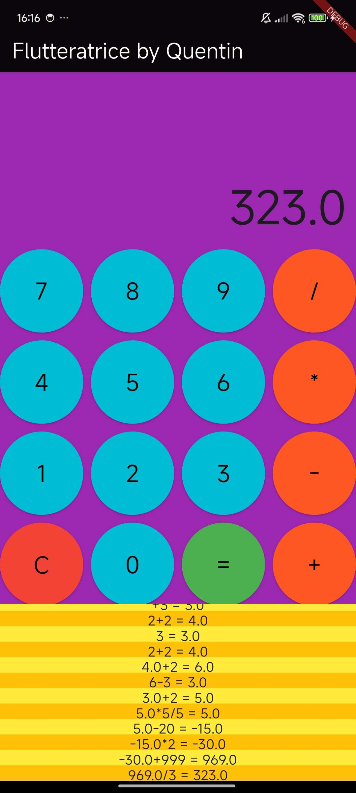

# flutter_calculatrice

Bonjour, calculatrice + flutter = flutteratrice, bonne journée.

## Design

Quelque chose à redire sur le choix des couleurs ? 

## Difficultés & Solutions

Venant du web, appliquer les styles de manières granulaires aux boutons n'étaient pas intuitif du tout. Après plusieurs documentation, j'ai finis par trouver la méthode que j'ai implémenté afin de 
regrouper tout le style à un même endroit au lieu de le dispatcher au milieu des Widgets (bien que je n'ai pas modifié pour le reste des propriétés). 

Pour ce premier projet, je trouve le code pas très propre, tout est dans un même widget et j'attends avecimpatience de voir comment séparer tout ça pour améliorer l'organisation du projet. 

## Erreur

Si l'utilisateur saisis 2 opérateurs de suite avant de calculer (ex: "2+*4), une erreur est capturée, un message affiché en bas d'écran et la formule se réinitialise. 

## Image

